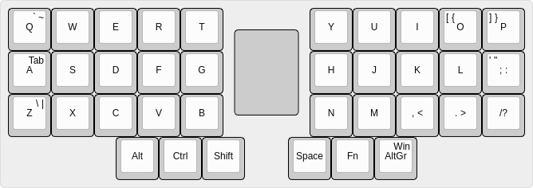
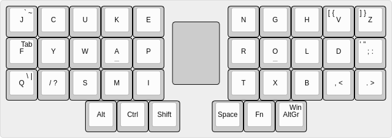
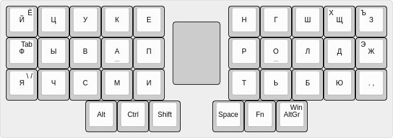
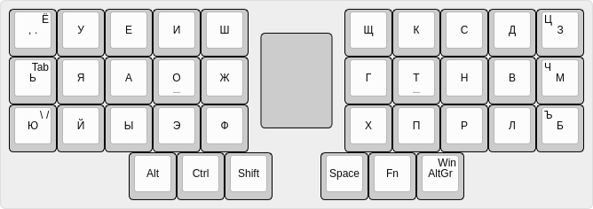
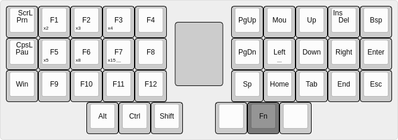
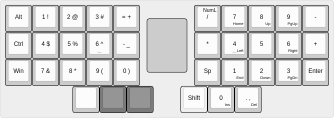
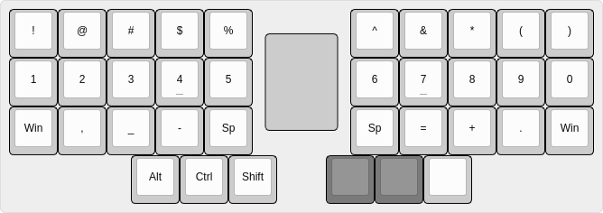
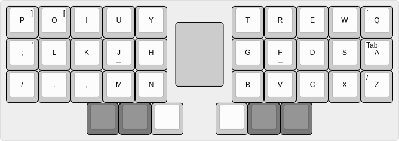
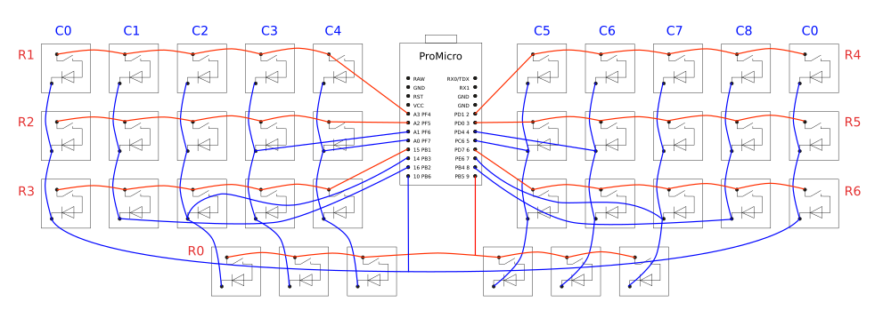

# Аккордовая полисимвольная клавиатура Коденец (Codenets)

Клавиатура предназначена для мягкого перехода с обычной печати на аккордовую полисимвольную ([Кладенец][kladenets]).

Хотя клавиатура и аккордовая, на первой ступени можно печатать буквы поочерёдно, как это делается на обычной клавиатуре, при этом модификаторы, слои, и буквы -- на аккордах, будут вводиться как аккордовые, то есть, можно сначала нажать кнопку буквы, и удерживая её, кнопку выбора другого слоя, сработает буква из другого слоя после отпускания аккорда.

На второй ступени буквы вводятся уже аккордами сразу по нескольку, здесь очерёдность печати будет уже определяться по определённым правилам, и не будет зависеть от порядка ввода букв.

На третьей ступени переходим на полностью Кладенец, при этом шесть кнопок уже не будут использоваться (боковые на указательных пальцах).

## Раскладки и слои в клавиатуре

Стандартная английская раскладка, она же используется для ввода клавиатурных сочетаний с модификаторами (Ctrl, Alt, Win) при работе на не стандартной английской раскладке (Dvorak, Colemak, JCUKEN, и другие), но можно настроить и для работы с клавиатурными сочетаниями из другой раскладки.

Боковые кнопки со стандартной клавиатуры вынесены на аккорды рядом стоящими пальцами по периметру клавиатуры. Для ввода `[` требуется нажать вместе `io`, для ввода `]` -- `op`, и так далее.

Фонетическая раскладка, близкая к советскому стандарту печати латинских букв.

Стандартная русская раскладка.

Болгарская раскладка (немного изменена).

Слой навигации и функциональных кнопок. Для выбора слоя требуется нажать Fn раньше, чем кнопки выбора других слоёв (смотри картинки ниже), это единственная не аккордовая комбинация кнопок на клавиатуре.

В клавиатуре нет автоповтора нажатой кнопки, его заменяет функция умножителя. Некоторые функциональные кнопки вместе с кнопками с правой части клавиатуры становятся умножителем нажатия кнопки, `x2` означает, что выбранная кнопка будет нажата дважды, например, если нажать Fn+F1+Left, то курсор будет передвинут на две позиции. Кнопки умножители можно нажимать вместе, тогда их коэффициент умножения будет складываться, таким образом на верхнем ряду можно получить умножитель 2+3+4=9, а на нижнем 5+8+15=28, что уже позволяет передвигаться стрелками поэкранно.

В цифровом слое присутствует два цифровых блока разного типа, слева это блок как в телефонах или банкоматах, справа стандартный компьютерный цифровой блок или калькулятор. Есть ещё и цифровой ряд, который находится в символьном слое, смотри ниже.

Цифровой блок слева позволяет работать с ним лишь левой рукой, например когда правая рука занята мышью, при этом можно вводить клавиатурные сочетания с модификаторами, для масштабирования текста или гравфики, или переключения по номерам вкладок, окон, рабочих столов.

Символьный слой содержит привычно расположенные символы, те что на стандартных клавиатурах на цифрах с шифтом, и более удобные `-_=+`. Так же содержит цифровой ряд на домашнем ряду, кому удобнее работать с цифрами в таком виде.

Зеркальный слой нужен для ввода букв одной рукой с другой половины клавиатуры, например при работе мышью в графическом редакторе, где буквы это команды для переключения инструментов. Может использоваться левшами правой рукой.

## Настройка клавиатуры

При нажатии сложного, и нереального при реальной работе, аккорда Fn+u+k+o+; или Fn+j+i+l+p включается режим настройки клавиатуры, где следующий аккорд позволяет настроить следующие параметры:

Группа кнопок `QWERT` задаёт количество используемых раскладок, `Q` это одна раскладка, `W` это две раскладки.

Группа кнопок `ASDFG` задаёт **первую** раскладку из списка: 1) QWERTY, 2) JCUKEN, 3) Dvorak, 4) Colemak, ... Номер определяется двоичным кодом, то есть суммой чисел: A=1, S=2, D=4, F=8, G=16. Если сумма превысит количество имеющихся раскладок, то раскладка не будет выбрана. Если раскладка не выбрана, то будет использоваться текущая.

Группа кнопок `ZXCVB` задаёт **вторую** раскладку из того же списка.

...

Если в аккорде пристутствует AltGr, то указанные настройки будут **сохранены** в постоянную память микроконтроллера (EEPROM).

## Схема

Для удобства сборки использованы все порты микроконтроллера, но возможно подключить клавиатуру по любой другой схеме, нужно будет лишь написать свой файл сканирования портов вместо `codenets.h`.

## Сборка и загрузка прошивки

Собрать проект можно командой:

	$ cd firmware
	$ make

Если проект не собирается, следуйте инструкциям, которые будут выведены в консоль.

Нажимаем кнопку на контроллере, и прошиваем содержимое файла codenets.hex в постоянную память контроллера:

	$ make avrdude

Настройки порта для работы avrdude находятся в файле `makefile` в параметре `AVRDUDE_PORT`.

Если прошиваемся с этой же клавиатуры, то сначала запускаем нижеследующую команду, и сразу же замыкаем контакты `RST` и `GND` на контроллере, если не успеваете замкнуть их, увеличьте количество секунд в команде sleep:

	$ sleep 5; make avrdude

Пользователь, от которого запускается прошивка должен состоять в группе `dialout`, можно добавить себя в эту группу командой:

	$ sudo adduser <user_name> dialout

После этого нужно будет зайти заново в систему, либо в терминале выполнить:

	$ su - <user_name>

, где `<user_name>` это ваш логин.

Если при прошивке валятся ошибки записи, то отключите сервис `modemmanager`, или удалите его:

	$ sudo apt remove modemmanager

[kladenets]: https://github.com/ibnteo/kladenets
